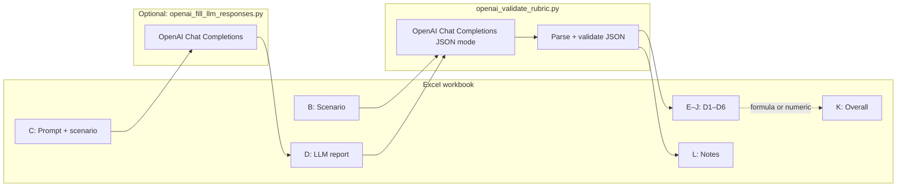

# AI Report Validation System — documentation

**Validation system & experiment**

This document summarizes the **rubric**, **experimental design**, **statistics**, **software architecture**, and **how to run** the **AI Report Validation System** prompt-comparison pipeline. It matches the implementation in this repository (see also [README.md](../README.md)).

### Checklist — course / submission requirements → where to find it

| Requirement | Covered? | Location |
|---------------|----------|----------|
| Brief documentation for the validation system | Yes | Whole file; especially **§1**, **§4**, **§6**. |
| **Validation criteria table** (dimension name, description, scale, benchmark) + **contrast vs LAB Likert** | Yes | **§1** (table + qualitative benchmarks + “How this differs…”). |
| **Experimental design** (which prompts, scores per prompt, sample size) | Yes | **§2** (table). |
| **Statistical analysis** (tests, **hypotheses**, **results**, **interpretation**) | **Partial** | **§3**: hypotheses and **which** tests (RM **ANOVA**, **paired t** post-hocs, **OLS regression**) are fully described. **Numeric F, p, and your interpretation** are **not** fixed in this file — they depend on your workbook. Fill them from your generated report (**§3 “Your results”**) or paste stdout / Word output. |
| **System design** + **AI reviewer’s role** | Yes | **§4** (numbered steps + Mermaid diagram). |
| **Technical details** (API keys, packages, file structure) | Yes | **§5** (+ root `README.md`). |
| **Usage instructions** (install, setup, validate, experiment) | Yes | **§6** (step-by-step commands). |

---

## 1. Validation criteria table

Each LLM report (column **D**) is judged against the scenario (column **B**) on **six dimensions** (columns **E–J**). Scores are **integers from 1 to 5** on every dimension. The **Rubric** sheet in the workbook repeats the same anchors and dimension guidance for human readers; the automated validator uses aligned text in `scripts/openai_validate_rubric.py` (`SCORING_RUBRIC_BLOCK`).

| Dimension | What it measures (short) | Scale / measurement | Benchmark / anchors |
|-----------|--------------------------|---------------------|---------------------|
| **D1 — Groundedness** | Unsupported claims, hallucinations, fabricated assumptions vs staying close to the scenario. | Discrete **1–5**; higher = more grounded. | **1** very poor · **2** weak · **3** acceptable · **4** good · **5** excellent (same anchors for all D1–D6). |
| **D2 — Structural Completeness** | Organization, section coverage, logical flow of the report. | Discrete **1–5**. | Same 1–5 anchors. |
| **D3 — Technical Depth** | Systems-level reasoning, causal analysis, engineering insight. | Discrete **1–5**. | Same 1–5 anchors. |
| **D4 — Uncertainty Handling** | Acknowledgment of ambiguity, calibration, missing data. | Discrete **1–5**. | Same 1–5 anchors. |
| **D5 — Actionability** | Usefulness and specificity of recommendations. | Discrete **1–5**. | Same 1–5 anchors. |
| **D6 — Professional Quality** | Clarity, tone, readability, professionalism. | Discrete **1–5**. | Same 1–5 anchors. |
| **Overall (K)** | Summary of rubric performance for that row. | In the template, **Excel formula** `=AVERAGE(E:J)` (or a **numeric** cell if overwritten). | Bounded by the 1–5 rubric inputs; analysis prefers **numeric K** when present (see README). |

**High vs low qualitative benchmarks** (per dimension) are spelled out on the **Rubric** sheet and in the validator prompt (e.g., D1 high: stays close to scenario and labels assumptions; D1 low: fabricates specifics).

### How this differs from a typical course LAB Likert setup

Many lab Likert exercises use **one or a few global rating scales** or **paper forms**, often **without**:

- **Six fixed engineering-report dimensions** tied to a **scenario + generated report** pair,
- A **machine-readable JSON contract** (exact keys, integer range checks) before scores are written,
- **Automated batch scoring** into a structured workbook (**E–J**, **L**) with **repeatable** prompts and retries.

Here, the **same 1–5 numeric scale** is used as in classic Likert items, but the **measurement model** is **multi-dimensional**, **task-specific** (systems engineering assessment quality), and **operationalized** through an **AI reviewer** plus spreadsheet validation—not only a single Likert thermometer or anonymous paper tally. *Adjust this paragraph if your instructor’s LAB used a different instrument so the contrast is accurate.*

---

## 2. Experimental design

| Element | In this project |
|---------|-----------------|
| **Prompts compared** | **Three conditions**: **Prompt A**, **Prompt B**, and **Prompt C** — implemented as three parallel sheets with the **same ten scenario rows** but **different composed prompts** (column **C**) and thus different LLM outputs (column **D**). |
| **Scenarios** | **10** per sheet (`FIRST_DATA_ROW`–`LAST_DATA_ROW` in `experiment_constants.py`). |
| **Validation scores per prompt** | For each prompt sheet, up to **10 rows** × **6 dimensions** = **60** rubric integers (**E–J**), plus **10** **Overall** values (**K**) when filled — **70** numeric score cells per prompt if complete. |
| **Sample size for repeated-measures stats** | **10 “subjects”** = **10 scenarios**, each measured under **A, B, and C** (within-scenario / repeated-measures on **Overall** for omnibus tests in `analyze_prompt_significance.py`). |
| **Design type** | **Within-subject**: same scenario IDs appear under each prompt; comparisons are **paired** at the scenario level. |

---

## 3. Statistical analysis

The primary report is produced by **`scripts/analyze_prompt_significance.py`** (Word `.docx` by default; `--stdout-only` for text).

### Hypotheses (Overall score)

- **Omnibus (repeated-measures ANOVA):**  
  - **H₀:** Mean **Overall** is the same for **Prompt A**, **B**, and **C** (for the population of scenarios like yours).  
  - **H₁:** At least one prompt mean differs.

### Tests run (high level)

This project uses a **repeated-measures** design, so the **primary** inference for “which prompt differs?” is **not** an independent-samples **t**-test on pooled rows. Instead:

1. **Descriptive statistics** — mean and SD of **Overall** by prompt (complete cases only: scenarios with non-missing A, B, and C).
2. **One-way repeated-measures ANOVA** — within factor = **Prompt**; subject = **ScenarioID**; dependent variable = **Overall** (implemented with **Pingouin**; sphericity corrections as appropriate). This is the **omnibus** test for differences across A, B, and C.
3. **Partial η²** — effect size for the prompt main effect.
4. **Post-hoc** — **paired** **t** tests on scenario-level differences (e.g. B−A, C−A, C−B) with **Holm** adjustment across the family of tests. (These are **paired** / **dependent** contrasts, aligned with the RM design.)
5. **Regression** — **OLS** of **Overall** on prompt indicators (reference **A**) with **cluster-robust** standard errors (**cluster = scenario**), reporting marginal mean differences with uncertainty; complements the ANOVA / post-hoc view.

### Where your numeric test results live

Static documentation cannot state **your** **F**, **df**, **p**, or which pairs differ — those come from **your** scored workbook. After you run:

```bash
python3 scripts/analyze_prompt_significance.py --workbook YOUR.xlsx
```

use the generated **`*_significance_report.docx`** or **`--stdout-only`** output for **§3 “Your results”** in this file or for your write-up.

### Your results (fill in from your report)

After you run the report, paste **your** numbers here or in your submission:

- Omnibus: **F(df₁, df₂) = …**, **p = …**  
- Partial η² = …  
- Pairwise: which contrasts significant after Holm?  
- **Interpretation:** e.g. which prompt had the highest mean **Overall**, and whether post-hocs support strictly ordering A < B < C or only some pairs differ.

```bash
python3 scripts/analyze_prompt_significance.py --stdout-only --workbook prompt-worksheet_AB.xlsx
```

---

## 4. System design (how validation works)



1. **Workbook** holds scenarios, composed prompts, and (after filling) LLM text in **D**.  
2. **Optional generator** (`openai_fill_llm_responses.py`) sends column **C** to OpenAI and writes **D**.  
3. **Validator** (`openai_validate_rubric.py`) builds a user message from **B** + **D** and a **system + rubric + JSON schema** instruction set.  
4. The **AI reviewer** (same API family as the generator, but typically used as a *judge*) returns **JSON** with six integer scores and fields such as `overall_mean` and `comments`.  
5. The script **validates** types and ranges, writes **E–J** and **L**, and saves the workbook. Column **K** may remain a formula (`AVERAGE(E:J)`) unless you replace it elsewhere in your workflow.  
6. **Analysis scripts** read the three sheets, build a long table (`build_long_frame` in `analyze_rm_anova.py`), and run the statistics described in section 3.

---

## 5. Technical details

| Topic | Detail |
|--------|--------|
| **Language** | Python **3.10+** recommended. |
| **Packages** | See **`requirements-analysis.txt`**: pandas, openpyxl, pingouin, scipy, statsmodels, python-docx, matplotlib, **openai**, **python-dotenv**. |
| **API key** | **`OPENAI_API_KEY`** in a project-root **`.env`** file (copy from **`.env.example`**). Loaded by **`scripts/openai_env.py`**; do **not** commit `.env`. |
| **Key layout** | **`scripts/experiment_constants.py`** — column indices, row ranges, sheet names. |
| **Rubric text (API)** | **`scripts/openai_validate_rubric.py`** — `SCORING_RUBRIC_BLOCK`, `JSON_SCHEMA_INSTRUCTIONS`. |
| **Rubric text (Excel)** | **`scripts/rubric_sheet.py`** — `populate_rubric_sheet()`. |
| **Layout / validation rules** | **`scripts/workbook_layout.py`**. |

**Repository layout (short):**

- `scripts/build_prompt_worksheet.py` — template / sync rubric columns.  
- `scripts/migrate_add_rubric_columns.py` — add **E–L** to older files.  
- `scripts/openai_fill_llm_responses.py` — fill **D**.  
- `scripts/openai_validate_rubric.py` — score **E–J**, **L**.  
- `scripts/clone_prompt_scores_workbook.py` — copy workbook; optional synthetic tweaks.  
- `scripts/analyze_rm_anova.py` — RM ANOVA CLI + CSV export.  
- `scripts/analyze_prompt_significance.py` — full **.docx** report + figures.

---

## 6. Usage instructions (quick path)

### Step 0 — One-time setup

```bash
cd "/path/to/your-clone"
python3 -m venv .venv
source .venv/bin/activate          # Windows: .venv\Scripts\activate
pip install -r requirements-analysis.txt
cp .env.example .env
# Edit .env: set OPENAI_API_KEY=sk-...
```

### Step 1 — Workbook

```bash
# Create or sync template (does not wipe column D unless --force-rebuild)
python3 scripts/build_prompt_worksheet.py --output prompt-worksheet.xlsx
```

### Step 2 — Generate LLM responses (optional)

```bash
python3 scripts/openai_fill_llm_responses.py --workbook prompt-worksheet.xlsx
# Add --overwrite only if you intend to replace existing D cells
```

### Step 3 — Run validation (rubric scores)

```bash
python3 scripts/openai_validate_rubric.py --workbook prompt-worksheet.xlsx
# Add --overwrite-scores to re-score rows that already have E–J
```

### Step 4 — Statistical report

Point `--workbook` at the file you want to analyze (example default in repo: `prompt-worksheet_AB.xlsx`):

```bash
python3 scripts/analyze_prompt_significance.py --workbook prompt-worksheet_AB.xlsx
# Output: <workbook_stem>_significance_report.docx beside the workbook
```

**Tips**

- If **K** is a formula, open the workbook in Excel once and **Save** so cached values exist for analysis (`data_only=True` in code).  
- Use **`--dry-run`** on OpenAI scripts to count work without calling the API.  
- For a text-only stats dump: **`--stdout-only`** on `analyze_prompt_significance.py` (figures section omitted).

---

## Document history

This file documents the **AI Report Validation System** and is maintained alongside the code. If you change rubric dimensions or row counts, update **sections 1–2** and **`experiment_constants.py`** / **`rubric_sheet.py`** / **`openai_validate_rubric.py`** together.
